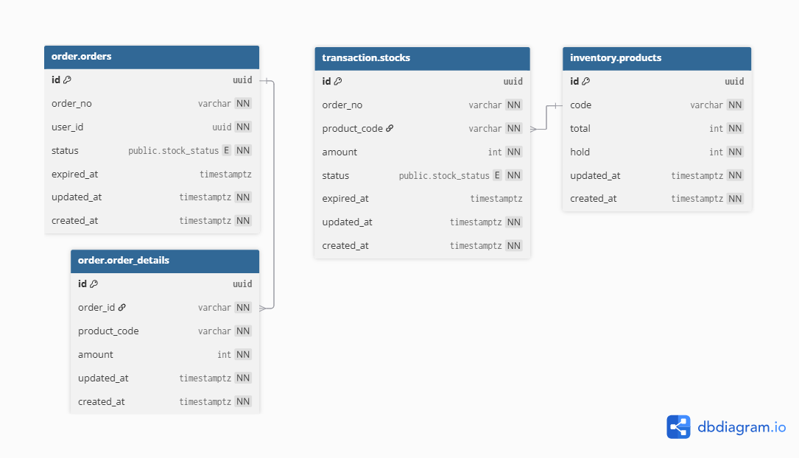

# SynasisHouse

Warehousing Microservices with Choreography Pattern

***

There are 2 (at least) main services to handle the ordering and warehousing process: **Order** and **Inventory** services.

The Order acts as a facade for the upstream service, which has responsibilities to orchestrate the user's order placement and notification brokering.

Inventory serves as the single source of truth for **product and stock management**. It maintains robustness of product availability and consistency of stock, especially for **distributed transactions,** by leveraging **PostgreSQL** ACID properties.

Communication between services using the **gRPC protocol**, and there is a gateway as a **reverse proxy**, while securing the backend from outside exposure.

Each order has an expiry, which is 24 hours after stocks are checked out. Once a transaction expires and the order is still 'pending,' the Order service will send release-related stocks to the Inventory service through **RabbitMQ** delayed messaging asynchronously.

## Design Architecture


</br>
<details>
  <summary><strong>Choreography Pattern</strong></summary>
  
</details>

### User and Product Management (Recomendation)

It should be considered to provide the **User**, **Notification**, and **Product** services independently.

User service stores user profiles to PostgreSQL and their sessions in **Redis** (which is scalable enough) and routes notifications to the Notification service.

Product service is the place where Admin ships the product or stocks to the Inventory service.

<!-- ### Cache

Display total stock for user from **cached product data**. The total product stocks are stored using *write-through* pattern due to frequently accessed and updated data. -->

<!-- ### Observability

Elasticsearch and Filebeat -->

## Data Model



More details in: <https://dbdocs.io/ymanshur/SynasisHouse>

<!-- ### Notable Decisions -->

## Getting Started

```bash
make compose
```

### Container Registry (hub.docker.com)

Pull the images from <https://hub.docker.com/repository/docker/ymanshur/synasishouse>

<!-- ## Inventory API

Open <https://ymanshur.github.io/synasishouse/docs/swagger/> to see API documentation based on the gRPC Gateway proto annotation. -->
