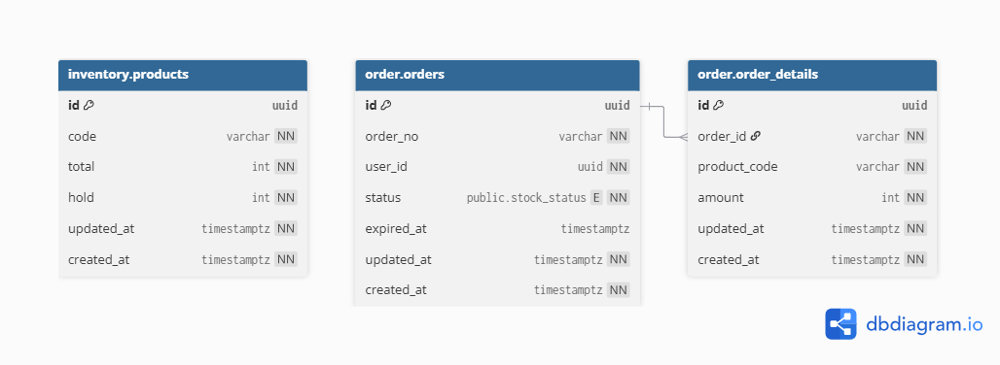

# synasishouse

Warehousing Microservices with Choreography Pattern

***

There are 2 main services to handle the ordering and warehousing process: **Order** and **Inventory** services.

The Order acts as a facade for the upstream service, which has responsibilities to orchestrate the user's business, including ordering and notification brokering.

While Inventory serves as the single source of truth for **product and stock management**. It maintains robustness of product availability and consistency of stock, especially for **distributed transactions** by leveraging **PostgreSQL** ACID properties.

Communication between services using the **gRPC protocol**, and there is a gateway as a **reverse proxy**, while securing the backend from outside exposure.

Each reserved stock is treated like a **transaction that has an expiry**. Every time a transaction expires, the Inventory service will publish the event and be consumed by the Order service, or at the time when the transaction will be reserved, then Inventory will send an invalid transaction error according to their expiry.

## Design Architecture


</br>
<details>
  <summary><strong>Choreography Pattern</strong></summary>
  
</details>

### User and Product Management

It should be considered to provide the **User** and **Product** services independently.

User service stores user profiles to PostgreSQL and their sessions in **Redis** (which is scalable enough) and routes notifications to the **Notification** service.

Product service is the place where Admin ships the product or product stocks to the Inventory service.

### Cache

Display total stock for frontend from **cached product data**. The total product stock is stored using *write-through* pattern.

### Observability

Elasticsearch and Filebeat

## Data Model



More details in: <https://dbdocs.io/ymanshur/SynasisHouse>

### Notable Decisions

- Only exposes shared references, not internal identifiers, i.e., `order_no` and `product_code`. As preparation for beyond service separation.
- Reference inventory and transaction are optional; consider decouple each other to minimize lock contention between transactional behaviour and expiry processing, as long as `product_code` never changes.

## Getting Started

```bash
make compose
```

### Container Registry (hub.docker.com)

Pull the images from <https://hub.docker.com/repository/docker/ymanshur/synasishouse>

## API

Open <https://ymanshur.github.io/synasishouse/docs/swagger/> to see API documentation based on the gRPC Gateway proto annotation.
